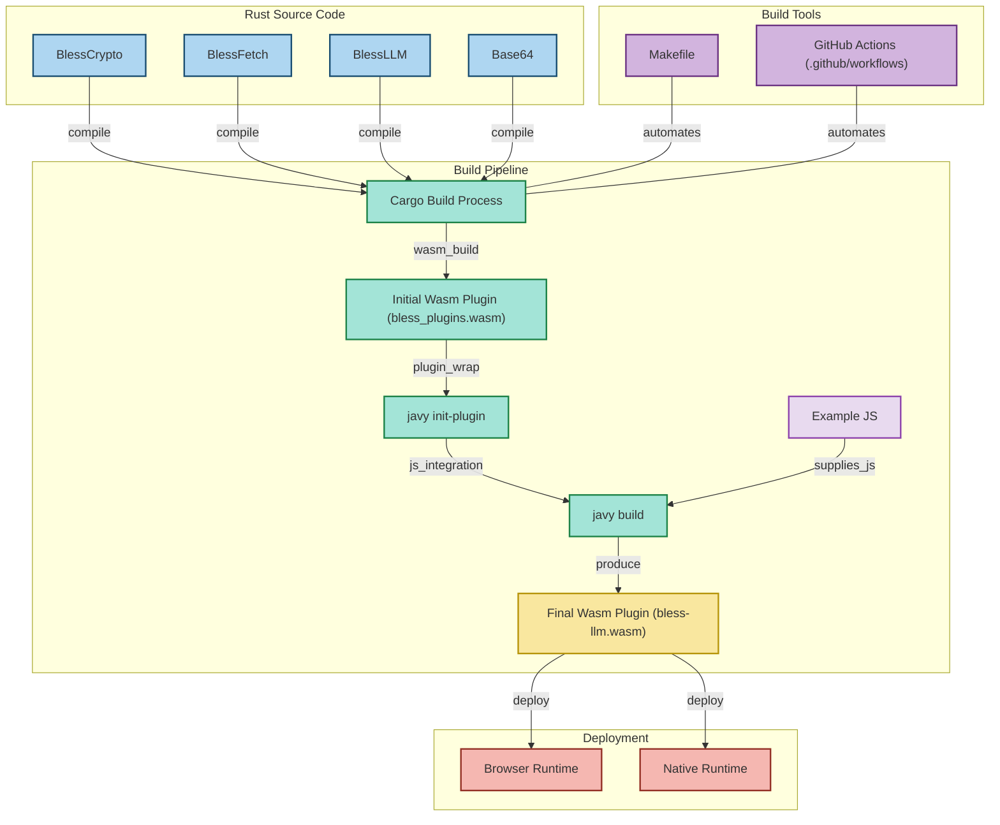

# Bless Javy Plugins

These are the plugins for the [Javy](https://github.com/blessnetwork/bls-javy) runtime.

## Plugins

| Plugin | Description | [Browser Runtime](https://github.com/blocklessnetwork/b7s-browser) supported | [Native Runtime](https://github.com/blessnetwork/bls-runtime) supported |
|--------|-------------|--------------------------|--------------------------|
| `BlessLLM` | A plugin for interacting with LLMs | ✅ | ✅ |
| `BlessFetch` | A plugin for interacting with HTTP / fetch | ✅ | ✅ |
| `BlessCrypto` | A plugin for interacting with the crypto library | ✅ | ✅ |
| `Base64` | A plugin for base64 encoding and decoding | ✅ | ✅ |

## Architecture



## Pre-Requisites

- [javy-cli](https://github.com/javy-dev/javy-cli)
  - Get the latest release from [here](https://github.com/bytecodealliance/javy/releases)

## Build

```sh
# build bless plugins
cargo build --target=wasm32-wasip1 --release

# rebuild the plugin-wasm with javy runtime CLI
javy init-plugin ./target/wasm32-wasip1/release/bless_plugins.wasm -o bless_plugins.wasm

# compile javascript to wasm with javy runtime and plugin
javy build -C plugin=bless_plugins.wasm ./examples/llm.js -o bless-llm.wasm
```
