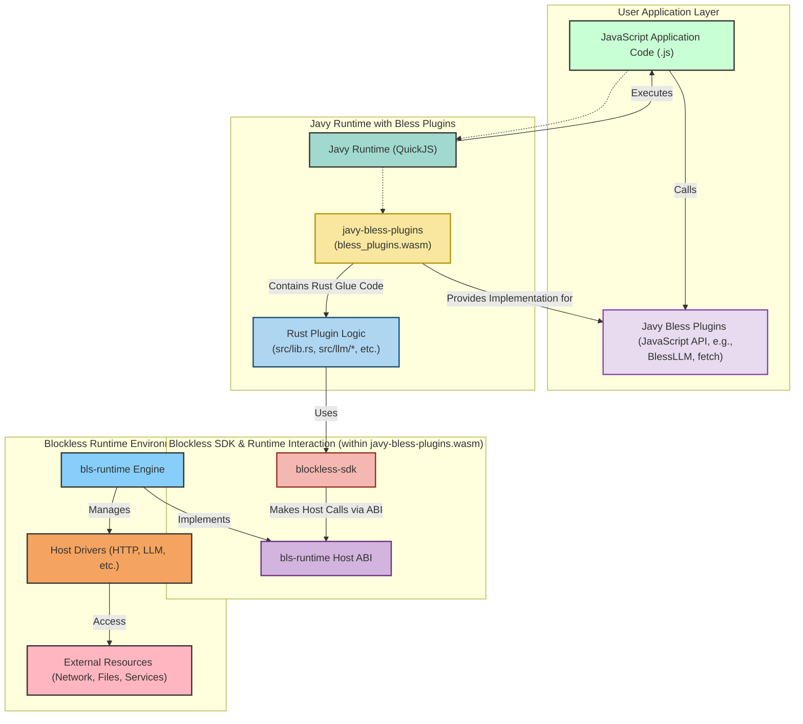
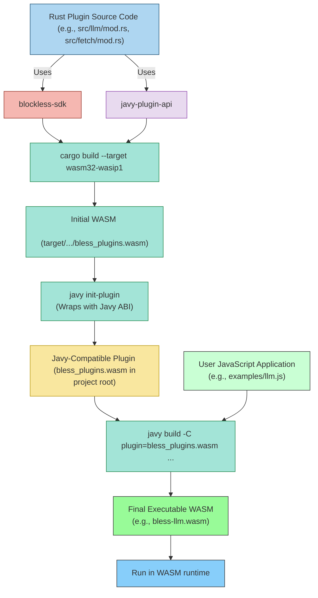

# Javy Bless Plugins Documentation

The Javy Bless Plugins project provides a bridge for JavaScript applications running in the [Javy runtime](https://github.com/bytecodealliance/javy) to access powerful host functionalities offered by the [Blockless Runtime (`bls-runtime`)](https://github.com/blocklessnetwork/bls-runtime).
It achieves this by leveraging the [`blockless-sdk`](https://github.com/blocklessnetwork/sdk-rust) to interact with the host and then exposing these capabilities to the JavaScript environment via Javy's plugin API.

This essentially allows JavaScript developers to easily leverage complex backend functionalities provided by the `bls-runtime` or `b7s-browser` (browser runtime) without needing to write Rust or directly deal with WASM ABIs, thanks to the Javy Bless Plugins acting as an intermediary.

## Overview

When you write JavaScript code to be executed by Javy, and you want to, for example, make an HTTP request or interact with an LLM, you're not directly calling `bls-runtime` host functions. Instead:

1. Your JavaScript code calls functions/objects provided by the Javy Bless Plugins (e.g., `BlessLLM()`, `fetch()`).
2. These JavaScript functions are implemented (or "backed") by Rust code within the `javy-bless-plugins` WASM module.
3. This Rust code, in turn, uses the `blockless-sdk` to make the actual calls to the `bls-runtime`'s (or browser runtime's) host functions.
4. The runtime executes these host functions (e.g., performing the HTTP request via its HTTP driver).
5. Results are passed back up the chain to your JavaScript code.

## Architecture

The following diagram illustrates the relationship between your JavaScript application, Javy Bless Plugins, the Blockless Rust SDK, and the `bls-runtime`.

**Key Components:**

* **JavaScript Application Code (.js):** This is the script you write, utilizing the global objects and functions exposed by Javy Bless Plugins.
* **Javy Runtime (QuickJS):** The JavaScript engine that executes your `.js` code.
* **Javy Bless Plugins (JavaScript API):** These are the JavaScript interfaces (e.g., `BlessLLM` constructor, `fetch` function) that your application code interacts with. These are defined in helper `.js` files (like `src/fetch/fetch.js`) which are embedded into the Javy environment by the plugin.
* **javy-bless-plugins (bless\_plugins.wasm):** This is the core WebAssembly module of the Javy Bless Plugins. It's built from Rust and includes:
    * **Rust Plugin Logic:** The Rust code (e.g., in `src/llm/mod.rs`, `src/fetch/mod.rs`) that implements the functionality for the JavaScript APIs. This code uses `javy-plugin-api` to bridge between Rust and QuickJS.
    * **blockless-sdk:** The Javy Bless Plugins Rust code depends on `blockless-sdk` to make the actual calls to the `bls-runtime`.
* **bls-runtime Host ABI:** The low-level Application Binary Interface through which WebAssembly modules (including `bless_plugins.wasm` via `blockless-sdk`) communicate with the `bls-runtime`.
* **bls-runtime Engine:** The execution environment that runs the Javy WASM module (which itself contains your JS code and the Bless plugins). It handles host function calls and delegates them to appropriate drivers.
* **Host Drivers:** Specialized modules within `bls-runtime` that perform the actual I/O or computation (e.g., making an HTTP request, interacting with an LLM).

### Build Process Flow

The `javy-bless-plugins` themselves are first compiled into a WASM module.
Then, Javy is used to embed your application JavaScript *into* another WASM module, linking against the `bless_plugins.wasm`.

1. **Plugin Compilation:**
  * The Rust source code for Javy Bless Plugins (which uses `blockless-sdk` and `javy-plugin-api`) is compiled into a raw WASM file (`target/.../bless_plugins.wasm`).
  * `javy init-plugin` processes this raw WASM, making it compatible with Javy's plugin

2. **Application Compilation:**
  * You write your JavaScript application (e.g., `examples/llm.js`).
  * `javy build` takes your JavaScript file and the Javy-compatible `bless_plugins.wasm` as input.
  * It compiles your JavaScript into QuickJS bytecode and bundles it with the QuickJS engine and the `bless_plugins.wasm` into a final executable WASM module (e.g., `bless-llm.wasm`).

3. **Execution:**
  * This final WASM module is then executed by the `bls-runtime`.

## Available Plugins (Exposed to JavaScript)

Javy Bless Plugins currently expose the following functionalities to JavaScript, each mapping to a corresponding module in the blockless-sdk-rust:

* BlessLLM (via blockless_llm):
  * Allows JavaScript to initialize LLM sessions, set options, and make chat requests.
  * Also exposes MODELS object for predefined model names.
* fetch (via blockless_http):
    * Provides a fetch-like API for making HTTP requests.
* crypto.getRandomValues (via host's random number generation capabilities, likely through WASI or a custom Blockless extension):
    * Provides a way to get cryptographically strong random values, mimicking the Web Crypto API.

The `src/lib.rs` file in `javy-bless-plugins` is crucial as it initializes the Javy runtime context, registers these global JavaScript objects/functions, and maps them to their underlying Rust implementations.
